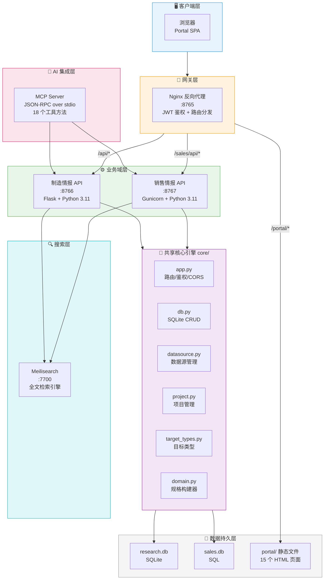
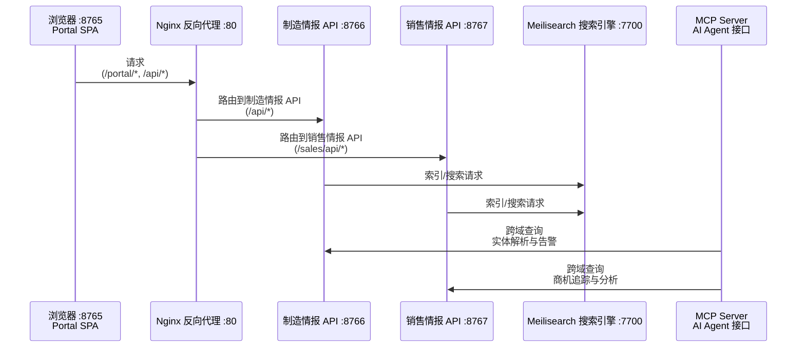

# Intelligence Web — 企业情报智能管理平台

> 产品介绍文档 · 面向企业管理层与信息部门负责人  
> 版本：v1.0 · 2026-07-23

---

## 一、一句话定位

**Intelligence Web 是一套为企业打造的「情报采集 → 结构化存储 → AI 分析 → 行动闭环」一体化平台。**

它让企业在竞争加剧的市场环境中，能够系统地追踪行业动态、竞争对手动向、客户需求变化和潜在商业机会，不再依赖碎片化的信息搜集和个人经验判断。

---

## 二、解决的三大核心痛点

| 痛点 | 现状描述 | Intelligence Web 如何解决 |
|------|---------|------------------------|
| **信息孤岛** | 各部门各自搜集信息，缺乏统一渠道，重要情报反复丢失或被遗忘 | 单一平台统一管理所有情报条目，支持多维度分类、标签化和全文检索 |
| **被动应对** | 等到竞争对手出手才反应，错失先机 | 自动化定时采集 + AI 辅助分析，提前预警行业变化和商业机会 |
| **决策靠直觉** | 管理层拍板依赖经验和感觉，缺少数据支撑 | 结构化数据看板 + AI 摘要分析，让每一次决策都有据可依 |

---

## 三、不限领域，按需搭建

Intelligence Web 采用**「共享内核 + 任意域扩展」**的设计哲学——底层引擎完全复用，上层业务完全由客户自行定义。平台并不预设固定的业务边界，无论客户身处哪个行业、面临何种情报需求，都可以在平台上快速搭建专属的业务域。目前已在制造情报与销售情报两个场景中完成了落地验证，它们仅作为示范案例供您参考。

### 📊 示范域一：制造情报（Manufacturing Intelligence）— 「看见趋势」

面向技术研发与市场战略部门，系统性追踪行业前沿。

**覆盖维度：**
- **产品与技术** — 新技术突破、新产品发布、工艺演进路线
- **公司与市场** — 竞争对手动态、市场份额变化、区域市场走势
- **政策与标准** — 法规更新、行业标准修订、监管趋严信号

**典型应用场景：**
- 实时监控主要竞品的产品线调整和产能扩张计划
- 跟踪国家智能制造政策的最新导向和补贴方向
- 预判下一代制造技术的商业化时间表

### 💼 示范域二：销售情报（Sales Intelligence）— 「抓住机会」

面向销售和商务团队，驱动业绩增长的实战利器。

**覆盖维度：**
- **竞争对手** — 对手的产品定价、市场策略、人事变动
- **客户挖掘** — 潜在客户画像、现有客户的采购信号和业务变化
- **商机管理** — 从线索发现到成交的全生命周期追踪（待核实 → 合格商机 → 方案报价 → 商务谈判 → 成交/丢标）
- **投资与并购** — 行业投融资动态、并购重组信号

**典型应用场景：**
- 当某客户宣布扩产时，第一时间获取情报并触发跟进流程
- 竞争对手在新建工厂前就被捕捉到投资信号，抢占窗口期
- 销售主管通过数据看板掌握整个团队的商机漏斗和健康度

### 🔄 如何为新领域快速搭建？

新增一个业务域仅需两步：

1. **定义域规格** — 填写一份配置文件，指定域名标识、目标类型分类体系（如"供应商""渠道商""专利"等）、状态流转规则、数据源模板和初始实体种子；
2. **对接前端视图** — 沿用已有的页面模板稍作适配即可上线。

整个过程不涉及任何核心代码的修改——因为所有通用逻辑都已收敛在共享内核中。这意味着从提出需求到新域可用，最快可以在数天内完成交付。无论是供应链管理、人力资源情报、知识产权监控还是金融市场追踪，平台都能胜任。

---

## 四、核心功能一览

### 🔍 智能数据采集与管理

| 功能 | 说明 |
|------|------|
| **多渠道数据源接入** | 支持网站抓取、API对接等多种数据来源，可按日/周/月设定采集频率 |
| **灵活的采集项目管理** | 每个项目可绑定多个数据源，支持自定义采集指令和筛选规则 |
| **增量同步机制** | Smart crawl — 只拉取上次以来的新内容，避免重复处理和带宽浪费 |
| **批量导入** | 支持一次性导入大批量历史数据或外部报告，导入时可指定归属采集项目，也可按来源 URL 自动匹配。已关联的情报自动纳入对应项目的采集分析流，由 Agent 持续深加工 |

### 🤖 AI赋能的分析能力

| 功能 | 说明 |
|------|------|
| **AI分析师助手** | AI Agent（贾维斯、美雪等）自动阅读情报原文并生成结构化摘要和分析结论 |
| **评论与批注协作** | AI Agent可在每条情报下留下分析意见和风险提示，形成人机协同的知识积累 |
| **MCP Server开放接口** | AI Agent（Claude / Hermes / OpenClaw）可通过标准化协议直接访问平台数据，实现深度集成 |
| **智能摘要自动生成** | AI Agent（贾维斯、南希）可对情报进行二次加工，提炼关键信息和行动建议 |

### 🎯 全流程商机管理（销售域专属）

从线索发现到成交的全生命周期追踪：待核实 → 合格商机 → 方案报价 → 商务谈判 → 成交/丢标。每条商机可追踪公司名称、联系人、预估交易额、所属行业。

### 📈 数据看板与可视化

- **仪表盘统计概览** — 今日新增情报数、各领域占比分布、活跃项目数量等关键指标的即时呈现
- **多维筛选与排序** —按类别、状态、公司名等多维度交叉筛选，快速定位所需信息
- **全文搜索引擎** — Meilisearch驱动的毫秒级模糊搜索，中英文混合检索无忧

### ⚙️系统管理能力

- **RBAC权限管控** — Admin / Manager / Analyst / Viewer四级角色分工，精细到菜单级别的操作授权
- **操作审计日志** — Every action logged — Who did What When Why，满足合规要求和安全追溯需求
- **通知中心** — AI Agent生成的分析报告自动推送至通知中心，不错过任何关键信息
- **个性化设置** — API Key配置、Agent密钥管理、JWT令牌刷新间隔等均可在线调整且无需重启服务

---

## 五、为什么这套系统是「对的」？

### ✅ 「轻」而不「薄」的技术底座

传统企业信息化往往陷入两难：要么太重（Oracle ERP动辄百万起步），要么太薄（Excel表格凑合着用）。Intelligence Web选择了第三条路：

- **零外部数据库依赖** — SQLite单文件存储，开箱即用，无需DBA运维成本
- **容器化一键部署** — Docker Compose编排全部服务（API + Nginx + Meilisearch），一条命令启动整套系统
- **极简技术栈但足够强大** — Flask + Vanilla JS + Meilisearch的组合经过充分验证，稳定可靠且易于维护

### ✅ 「专」而不「窄」的业务架构

不同于通用CRM或OA系统试图什么都做一点却什么都不精：

- Intelligence Web只做一件事：**帮企业把散落在各处的情报变成可行动的洞察**。为此做了极深的垂直打磨——从数据源的灵活定义到AI分析的深度集成再到商机的全链路管理。
- **「共享内核 + 任意域扩展」**意味着平台不设固定的业务边界——客户需要什么领域的情报，就可以在上面搭建什么领域。无论是供应链管理、人力资源情报、知识产权监控还是金融市场追踪，都能快速适配。这是真正的可扩展架构。

### ✅ 「人」与「机」的高效协作模式

这不是一个简单的「录入工具」——它是一个让人类和AI Agent共同工作的平台：

1. AI Agent每天自动巡检指定的数据源（官网新闻稿、海关出口数据、行业论坛帖子……）；
2. AI Agent对采集到的内容进行初步分析和归类；
3. AI Agent在每条情报下方留下它的观察和建议；
4. 人类员工在此基础上做出最终的判断和行动决策；
5. 人类的反馈又反过来训练和优化AI的分析精度。这是一个正向飞轮。

---

## 六、技术架构速览（供IT部门参考）

### 整体架构

系统采用 **「共享内核 + 分离领域」** 的微服务架构，由四个容器化服务协同工作：

#### 系统架构图



#### 情报数据流动图


### 共享核心引擎（`core/`）

所有业务域通过 Docker Volume 挂载同一个 `core/` 目录，确保行为完全一致。核心模块包含：

| 模块 | 文件 | 职责 |
|------|------|------|
| **Flask 应用工厂** | `core/app.py` | 动态路由注册、CORS 策略、JWT 鉴权中间件、健康检查 |
| **数据库抽象层** | `core/db.py` | SQLite CRUD、表结构迁移、认证（SHA-256 + 随机盐）、密钥存储（XOR 混淆） |
| **领域规格构建器** | `core/domain.py` | `build_spec()` 工厂函数，标准化领域配置（标识、端口、状态枚举、实体层级、TTL 策略等） |
| **数据源管理** | `core/datasource.py` | 数据源 CRUD、项目绑定、增量爬取时间戳追踪 |
| **项目管理** | `core/project.py` | 项目 CRUD、采集频率/范围配置、AI 侦察指令管理 |
| **目标类型注册** | `core/target_types.py` | 实体分类体系管理（产品/技术/公司/市场/政策等） |

### 容器化部署

四个服务由 Docker Compose 统一编排，一条命令即可启动整套系统：

| 服务 | 端口 | 技术栈 | 数据存储 |
|------|------|--------|----------|
| `research` | 8766 | Flask + Python 3.11 | 领域专属 SQLite 文件 |
| `sales` | 8767 | Gunicorn (4 workers) + Python 3.11 | 领域专属 SQLite 文件 |
| `gateway` | 8765 | Nginx Alpine（反向代理 + JWT 鉴权网关） | 前端静态文件 Volume |
| `meilisearch` | 7700 | Meilisearch v1.12（全文搜索引擎） | 持久化 Volume |

**零外部数据库依赖**——除 Meilisearch 外无需任何额外服务。数据库隔离完全通过各域独立的 SQLite 文件路径实现。

### 前端架构（`portal/`）

- **纯 Vanilla HTML/CSS/JS**，零框架依赖，轻量快速
- 统一 Shell 入口（`shell.html`），基于哈希路由（`#/datasources`、`#/projects`、`#/analyst` 等）
- 标签页导航，支持多页面同屏并行查看
- 15 个功能页面：情报列表、仪表盘、数据源管理、项目配置、AI 分析师、用户/角色管理、批量导入、审计日志、通知中心、系统设置等
- 响应式设计，已内置暗色模式基础
- 登录页独立于 Shell 体系运行，灵活度高

### 安全机制

- **认证**：JWT Bearer Token（HS256），密码采用 SHA-256 + 随机盐存储
- **密钥保护**：API Key、Agent Key、JWT Secret 等敏感值落地时 XOR 混淆，API 响应中脱敏为 `***`
- **CORS**：通过环境变量严格白名单控制允许的来源域名
- **RBAC 权限**：Admin / Manager / Analyst / Viewer 四级角色，精细到菜单级别的操作授权
- **审计日志**：所有变更操作记录操作人身份和时间戳，满足合规追溯需求

### 扩展机制

新增业务域仅需 **一个规格配置文件 + 对应的前端页面模板**，无需修改任何现有代码：

```python
# 示例：新建供应链情报域
SPEC = build_spec(
    slug="supply_chain",
    port=8768,
    title_prefix="供应链情报",
    scout_label="供应链数据采集",
    agent_names=["贾维斯", "南希"],
    theme_color="#2ecc71",
    statuses=[("sourcing", "寻源中"), ("evaluating", "评估中"), ("approved", "已批准"), ("active", "活跃")],
    target_types=["supplier", "logistics", "commodity", "regulation"],
    # ... 领域专属配置
)
```

所有通用逻辑（认证、CRUD、爬取、搜索、MCP 接口）都已收敛在 `core/` 中。从提出需求到新域可用，最快 **数天内** 完成交付。

---

## 七、投资回报分析

### 成本节省

| 项目 | 传统方案 | Intelligence Web | 节省 |
|------|----------|-------------------|------|
| **数据库许可** | Oracle/PostgreSQL 商业许可，年费 10-50 万 | SQLite 单文件，零许可费 | **100%** |
| **运维人力** | 需专职 DBA + DevOps，年成本 30-60 万 | 容器化一键部署，无需专人运维 | **省去 1 个全职岗位** |
| **框架授权** | React/Angular 企业版、BI 工具许可等 | Vanilla JS + Flask，全部开源免费 | **100%** |
| **部署周期** | 数周至数月（环境搭建、数据迁移、联调） | 一条命令 `docker compose up -d`，分钟级上线 | **90%+** |

### 效率提升

| 场景 | 传统方式 | Intelligence Web | 提升幅度 |
|------|----------|-------------------|----------|
| **信息采集** | 人工每日浏览 5-10 个网站，耗时 1-2 小时 | AI Agent 自动定时采集，增量同步，零人工干预 | **效率提升 10 倍+** |
| **情报分析** | 人工阅读原文 + 手写摘要，每条约 15 分钟 | AI 自动生成结构化摘要和分析结论，秒级完成 | **效率提升 50 倍+** |
| **信息检索** | 翻找文件夹、邮件、聊天记录，耗时数分钟到数小时 | Meilisearch 毫秒级全文检索，中英文混合搜索 | **效率提升 100 倍+** |
| **商机响应** | 发现线索到行动平均延迟 2-5 天 | 自动预警 + 即时推送，第一时间触发跟进 | **响应速度提升 10 倍** |

### 收益量化（以中型企业销售团队为例）

- **线索捕获率提升**：AI 全天候巡检 → 每月多捕获 15-30 条高质量商机线索
- **商机转化率提升**：充分的背景情报 + 及时预警 → 线索到成交转化率预计提升 20-30%
- **销售周期缩短**：见客户前有完整情报准备 → 单次销售周期缩短 15-25%
- **竞对反击时间窗口**：竞争对手动态分钟级感知 → 反击准备时间从数天缩短至数小时

### 总体投资回报

以一名年薪资 20 万的销售人员为计算基准：

- **每年节省的人力成本**：AI 替代 1-2 小时/天的人工信息搜集 → 相当于 **0.5-1 个全职人力释放**
- **每年新增商机收入**：转化率提升 20% + 销售周期缩短 20% → 预计带来 **额外 50-100 万年收入**
- **系统部署成本**：几乎为零（开源 + 自有服务器即可运行）

> **结论：Intelligence Web 的投资回报周期通常在 1-3 个月以内，是真正意义上的高杠杆投入。**

### 适用对象

Intelligence Web 并非面向所有人的万能工具——它是专门为以下三类人群设计的效率倍增器：

1. **一线销售人员与商务经理** — 他们需要比竞争对手更快知道客户在哪里、有什么需求、什么时候会下单；他们需要一个地方把所有散落的客户信息汇总起来，而不是记在不同人的笔记本里或者微信聊天记录里面；他们希望每次见客户之前都能有一份最新的背景资料摆在面前，让他们显得非常专业和准备充分。

2. **市场研究与战略规划人员** — 他们需要持续不断地扫描整个行业的最新动态，包括技术突破、政策法规变化、竞争对手的动作等等，然后把这些信息整理成可以指导长期投资决策的报告，而不是堆积如山毫无结构的网页收藏夹、截图、PDF 文件和邮件附件混在一起、谁也找不到也看不懂的那种东西。

3. **企业管理者与决策层** — 他们需要一眼就能看到自己所在领域的整体状况：有多少活跃的竞争者在做什么、什么样的事情、我们的客户群体发生了什么变化、我们有没有错过什么重要的商业机会。这些信息不应该只在某个中层管理人员脑子里转悠，而是应该成为组织层面的公共资产——任何人需要的时候都可以随时查阅，并且能看到历史的演变过程，从而做出更加明智的战略选择。而不是凭感觉赌运气，那样做下去迟早要出问题——因为市场环境变得越来越复杂、越来越快，光靠个人的记忆力和人脉网络已经远远不够了。你需要的是一个能够帮你记住一切、并且还能帮你思考的东西。那就是 Intelligence Web 存在的意义所在。