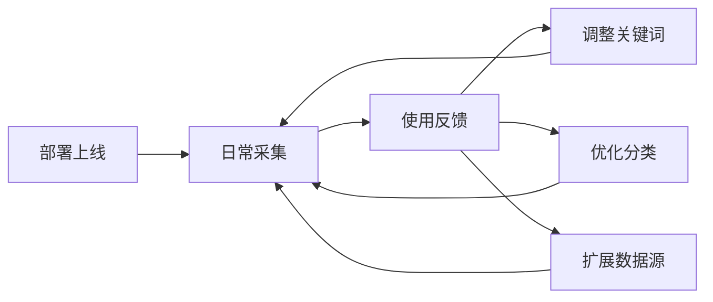

# 凯闻集团 · 情报系统建设方案

基于业务情报三大维度的系统化采集与管理

---

# 目录

<br>

- 客户背景与核心诉求
- 核心痛点分析
- 三大情报采集维度
- 情报流转机制
- 实施计划与路线图

---

# 客户背景

## 凯闻集团

- 行业：香精香料 / 食品配料
- 核心客户：和路雪、雀巢等乳品及冰淇淋厂商
- 目标市场：海内外中高端市场

## 主要竞争对手

| 对手 | 领域 |
|------|------|
| 丹尼斯克 (Danisco) | 全球食品配料巨头 |
| 凯瑞 (Kerry) | 全球风味与营养领导者 |
| 帕斯加 (Pascall) | 国际香精香料 |
| 李岩 | 海外竞品 |

---

# 关键参与方

| 角色 | 人员 | 职责 |
|------|------|------|
| 决策者 | 师兄 | 方向确认、业务需求把关 |
| IT 对接 | 陈工 | 技术环境配合 |
| 现场协助 | 小陈 | 基础搭建工作 |
| 最终用户 | 市场专员 | 日常系统使用 |
| 数据消费方 | 销售 / 研发 / 其他部门 | 情报应用 |

---

# 核心痛点

## 痛点一：员工埋头苦干，缺乏市场视野

> 现在的员工埋头苦干的比较多，抬头看路的要加强一下。就想通过你这个情报系统，让他们能够抬头看路。

- 员工普遍只关注本职工作，缺乏对外部市场的感知
- 需要一个系统化的情报平台来拓宽视野

## 痛点二：市场专员有编制无工具

> 有一个专门的市场人员……但是他手里没工具，自己也不会搞这个东西。

- 人员已配备，但缺乏有效工具支撑
- 不会自行搜集和整理情报数据
- 需要工具与培训双管齐下

---

# 情报采集三大维度

>> 小吴，再总结一次，就三个端——市场端、竞争对手的供应端、还有我们的研发端，三个角度去收集情报。

---

# 维度一：市场端

## 采集内容

- 市场总容量与规模
- 主要生产厂商及市场份额
- 各国细分市场数据，例如：
  - 越南的冰淇淋产量
  - 各国的冰淇淋及蛋糕产量
  - 蛋糕油的需求量

## 价值输出

- 为销售团队提供市场全景图
- 识别高潜力区域和品类
- 支持市场进入策略制定
- 输出：市场研究报告

> 研究各个国家相应的市场信息，比如说越南它的冰淇淋产量有多少，各个国家的冰淇淋、蛋糕的产量，蛋糕油的需求量，从这两个角度入手。

---

# 维度二：竞对供应端

## 核心追踪对手

<v-clicks>

- 丹尼斯克 (Danisco)
- 李岩
- 帕斯加 (Pascall)
- 凯瑞 (Kerry)

</v-clicks>

## 采集内容

<v-clicks>

- 竞争对手的经销商体系
- 竞争对手的客户体系
- 策略：从对手周边客户入手，寻找切入点
- 输出：竞争情报报告 + 潜在客户列表

</v-clicks>

> 主要找我们的中高端的客户，中高端的竞争对手，收集他们的经销商体系还有他们的客户体系，然后找到我们的切入点。

---

# 维度三：研发端

## 采集内容

- 竞争对手在推什么新产品
- 新配方与新应用的技术趋势
- 行业展会及学术论文动态
- 产品包装和市场定位变化

## 价值输出

- 为研发部门提供方向参考
- 避免重复投入
- 差异化产品定位
- 及时响应市场变化

> 研发也要通过竞争对手，他在推什么产品，然后相应的去发展我们的产品。

---

# 情报流转机制

```
采集层                   处理层                   分发层
┌──────────┐          ┌──────────┐          ┌──────────┐
│ 爬虫采集  │   →     │ AI 整理  │    →     │ 按部门推送│
│ 人工录入  │          │ 分类标注  │          │ 按需查询  │
└──────────┘          └──────────┘          └──────────┘
```

## 数据分发矩阵

| 接收方 | 数据类型 | 使用场景 |
|--------|---------|---------|
| 销售团队 | 对手客户体系、经销商信息 | 针对性开发客户 |
| 研发部门 | 竞争对手新品动态 | 指导产品研发方向 |
| 市场专员 | 市场容量、各国数据、行业报告 | 市场分析报告输出 |
| 其他部门 | 按需定制的数据简报 | 各自业务决策参考 |

---

# 切入点策略

> 从主要对手周边客户入手，扒尽量多的相关情报提供给咱们业务作为切入点。

<br>

## 三步走

1. **识别** — 识别对手的客户和经销商
2. **分析** — 分析他们的需求和痛点
3. **切入** — 找到我们的差异化切入点

核心思路：不直接正面竞争，而是通过情报发现对手客户体系中的机会点，用情报驱动销售。

---

# 持续改进机制

> 我们要爬什么信息，能够爬出来，整理出来就好了。然后不断的调整改进。

<br>



| 阶段 | 目标 |
|------|------|
| 初期 | 先跑通基础流程 |
| 中期 | 随着使用优化策略 |
| 长期 | 持续迭代升级 |

---

# 实施计划

| 步骤 | 内容 | 状态 |
|------|------|------|
| 1 | AI 服务器准备与基础环境部署 | 待启动 |
| 2 | 情报系统平台搭建 | 待启动 |
| 3 | 模型调参与技术适配 | 待启动 |
| 4 | 与陈工对接 IT 技术细节 | 待沟通 |
| 5 | 与业务部同事了解行业情报特征 | 待沟通 |
| 6 | 小陈协助现场搭建 | 待安排 |

## 人员协同

| 层级 | 人员 | 职责 |
|------|------|------|
| 决策层 | 师兄 | 方向确认 |
| 技术层 | 陈工 + 小陈 | 环境搭建配合 |
| 使用层 | 市场专员 | 日常运营 |

---

# 需求总结

## 三大目标

- **目标一**：让员工"抬头看路"，用情报驱动业务决策
- **目标二**：覆盖三个维度——市场端、竞对供应端、研发端
- **目标三**：从对手周边客户切入，持续迭代改进

<br>

> 凯闻集团 × 情报管理系统 — 2026年7月