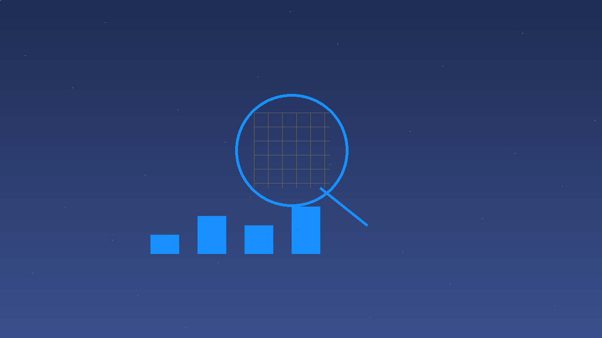
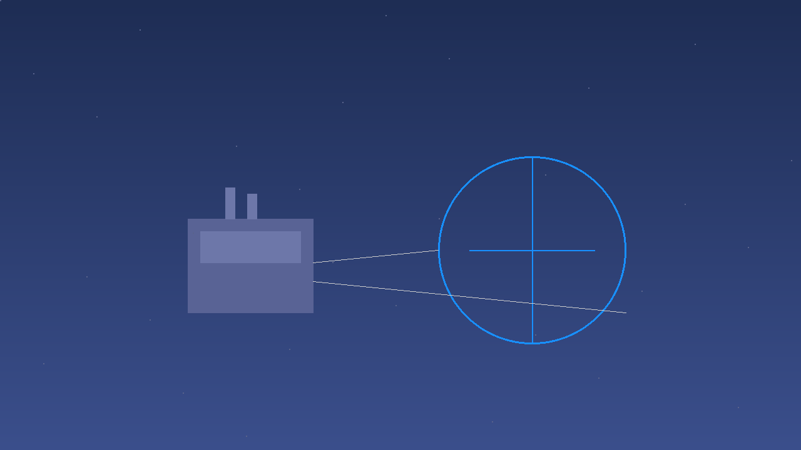

---
layout: center
background: ./images/cover_bg.png
---

情报关系系统

Intelligence Relationship System

专为凯闻集团打造

V1.0 · July 2026

---
layout: center
background: ./images/pain_point.png
---

员工埋头苦干，

却没有人抬头看路。

市场专员已有编制，但手中没有任何工具。

---
layout: center
---

SOLUTION

我们把散落的网络信息，

变成可检索、可分配的资产。

---
layout: two-cols
---

::left::

需求端情报

竞品、市场、客户动态

::right::

供应端情报

产能、价格、供应商动态

---
layout: center
---

需求端情报

竞争对手管理

丹尼斯克、理研、帕斯嘉等竞品信息统一管理

经销商体系

追踪竞品经销商布局，Excel批量导入

客户体系

终端客户画像，一键导出目标客户CSV

机会雷达

自动计算高价值业务切入点，Top5展示

市场规模

各国各品类数据对比，CR3/CR5集中度分析

新品追踪

时间轴+关键词云图，智能通知研发

---
layout: center
---

供应端情报

全球产能透视

按品种查看全球产能分布，悬停TOP3厂家

供需差值判定

供大于求/基本平衡/供不应求三色判定

价格趋势验证

供需判断与价格走势交叉验证一致性

供应商监控

并购/扩产/停产事件时间线，产能预判

议价支撑面板

供大于求时显示可选供应商和量化数据

需求估算器

填参即算，保存命名场景便于日后对比

---
layout: center
---

情报流转机制

采集层

爬虫采集+人工录入

→

处理层

AI整理+分类标注

→

分发层

按部门推送+按需查询

---
layout: center
---

权限管理体系

<table class="max-w-2xl mx-auto text-sm"><thead><tr class="bg-blue-900 text-white"><th class="px-4 py-2 text-left">角色</th><th class="px-4 py-2 text-left">能做什么</th><th class="px-4 py-2 text-left">不能做什么</th></tr></thead><tbody>
<tr><td class="px-4 py-2 text-blue-900 font-medium">管理员</td><td class="px-4 py-2">所有操作+管理用户</td><td class="px-4 py-2 text-gray-400">—</td></tr>
<tr class="bg-gray-50"><td class="px-4 py-2 text-blue-900 font-medium">业务骨干</td><td class="px-4 py-2">查看、新增、编辑</td><td class="px-4 py-2 text-gray-400">删除数据、管理用户</td></tr>
<tr><td class="px-4 py-2 text-blue-900 font-medium">只读用户</td><td class="px-4 py-2">查看所有数据</td><td class="px-4 py-2 text-gray-400">新增、编辑、删除</td></tr>
<tr class="bg-gray-50"><td class="px-4 py-2 text-blue-900 font-medium">AI分析师</td><td class="px-4 py-2">根据权限回答情报</td><td class="px-4 py-2 text-gray-400">访问看不到的数据</td></tr>
</tbody></table>

---
layout: center
background: linear-gradient(135deg, #3B4F8C, #1E2D54)
---

感谢聆听

让每一个决策都有据可依

凯闻集团 × 情报关系系统 — V1.0 · July 2026

